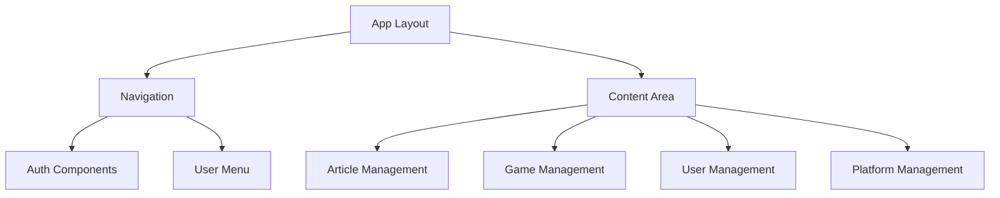
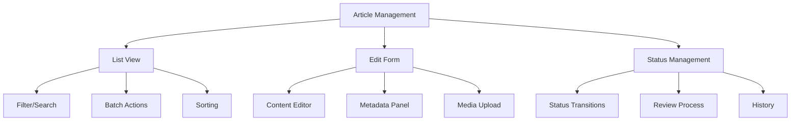
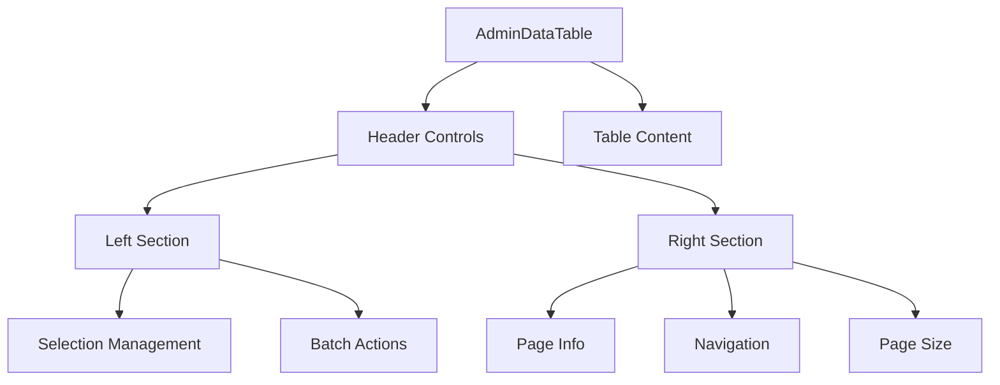
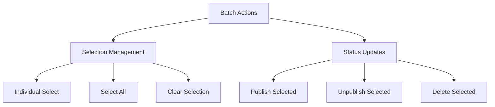
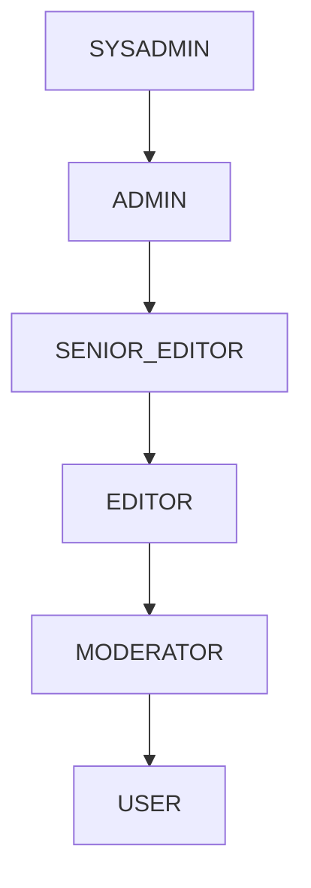
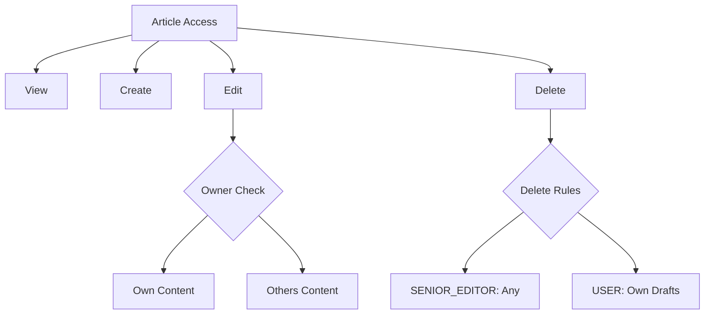
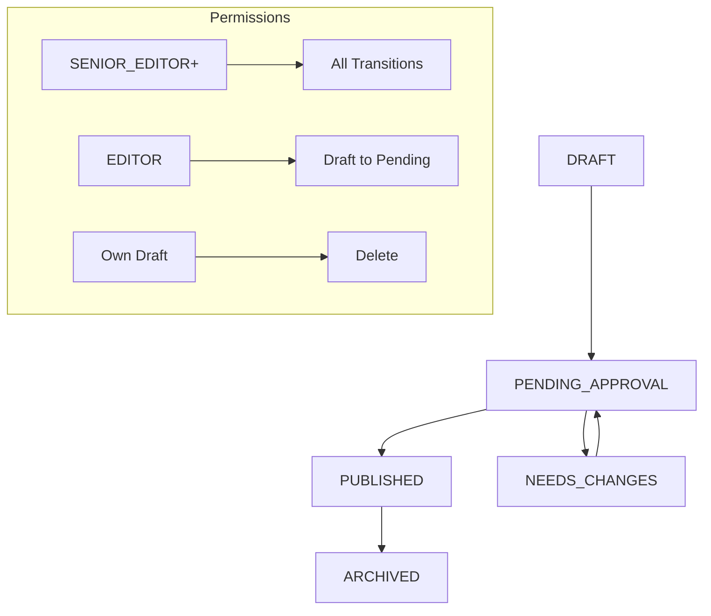

# System Patterns: Nexus Gaming News

## Interface Patterns

### Navigation

### Article Management

### Data Table Patterns

### Batch Operations

## Authorization Patterns

### Role Hierarchy

### Article Permissions

### Status Transitions

## Implementation Patterns

### Generic Components

#### Data Table

- Type-safe props et events
- Configuration flexible des colonnes
- Fonctions de rendu personnalisables
- Gestion intégrée de la sélection
- Actions par lot
- Organisation de l'en-tête :
  - Gauche : Info sélection et actions
  - Droite : Pagination et contrôles

#### Selection Management

- Sélection individuelle
- Contrôles de sélection en masse
- Persistance de l'état de sélection
- Gestion des ID typée
- Affichage du nombre de sélections
- Mise en page optimisée :
  - Hauteur d'en-tête constante
  - Transitions fluides
  - Hiérarchie visuelle claire
  - Affichage contextuel des actions

### State Management

#### Article States

- Statut de l'article
- État de la sélection
- État des actions en cours
- État des permissions

#### Batch Operations

- Interface de sélection multiple
- Contrôles d'actions en lot
- Retour de progression
- Gestion des erreurs
- Synchronisation d'état

### Validation

#### Permission Checks

- Vérification du rôle
- Vérification de propriété
- Règles de transition d'état
- Validation des actions en lot

#### Data Validation

- Champs requis
- Validation de format
- Validation métier
- Gestion des erreurs

### User Feedback

#### Visual Feedback

- États de chargement
- Transitions d'état
- Indicateurs de progression
- Messages d'erreur

#### Action Feedback

- Messages de succès/erreur
- Confirmations d'action
- Notifications de changement d'état
- Retour d'action par lot
